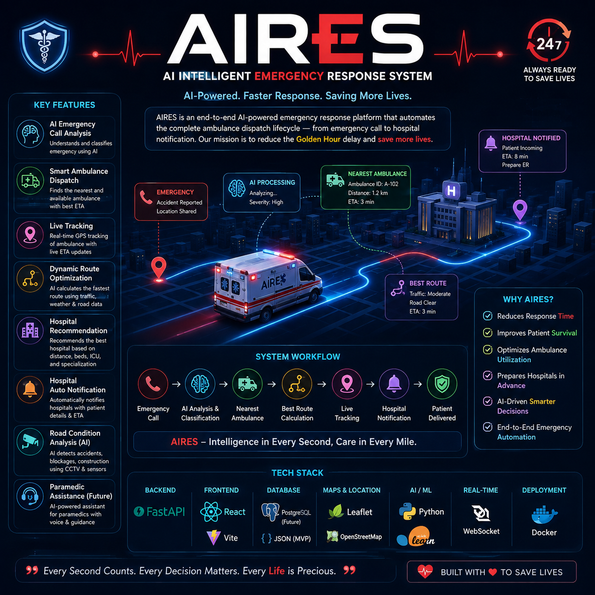
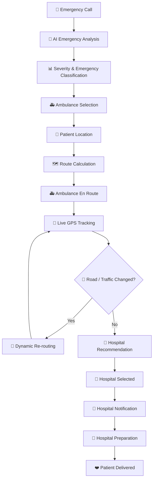
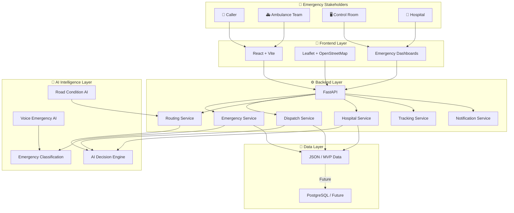
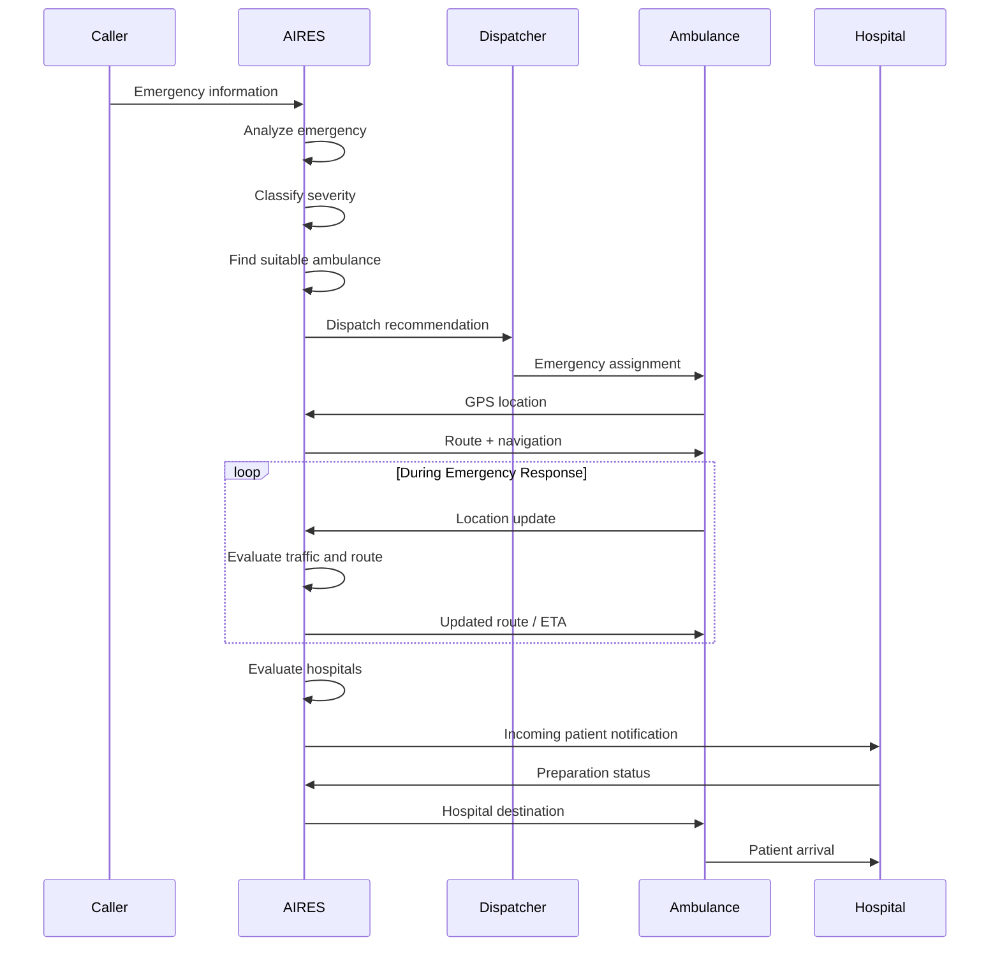
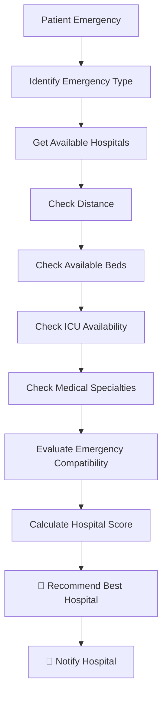
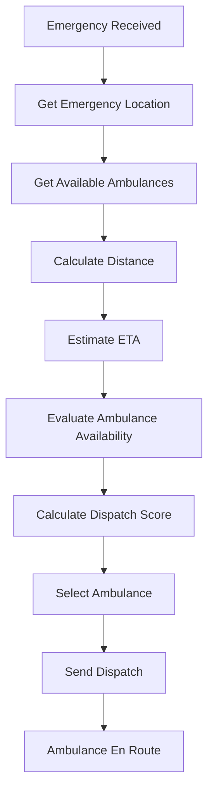
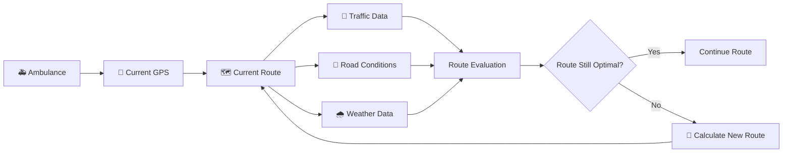
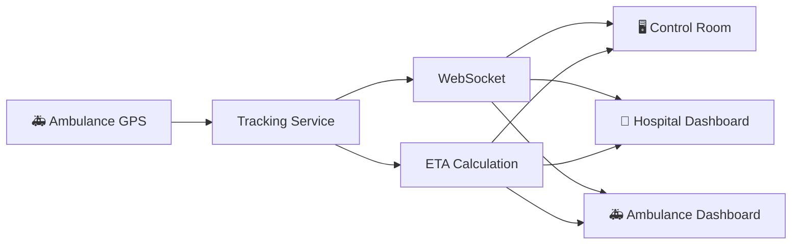
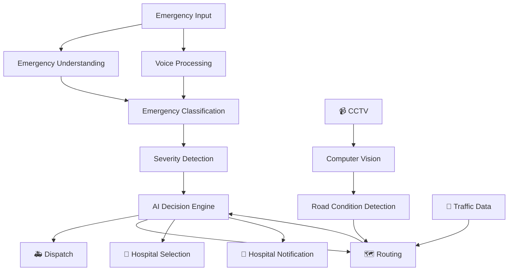
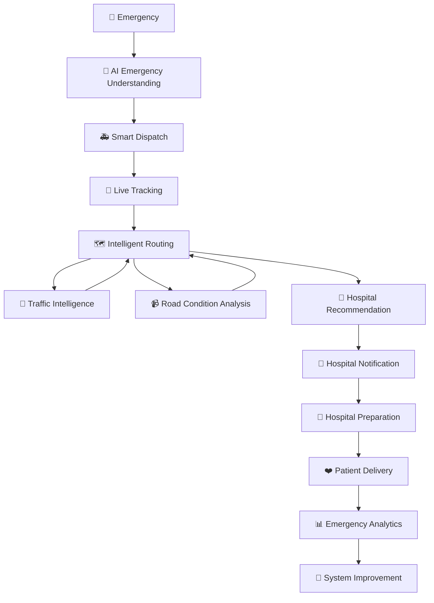

# 🚑 AIRES — AI Intelligent Emergency Response System

<p align="center">
  
</p>

<p align="center">
  <strong>AI-Powered Emergency Response • Intelligent Dispatch • Dynamic Routing • Hospital Coordination</strong>
</p>

<p align="center">
  <em>Every Second Counts. Every Decision Matters. Every Life is Precious.</em>
</p>

---

## 📌 Overview

**AIRES (AI Intelligent Emergency Response System)** is an end-to-end intelligent emergency response platform designed to improve the speed, coordination, and decision-making of ambulance emergency services.

Traditional emergency response systems often depend heavily on manual dispatcher decisions, static routing, delayed hospital communication, and fragmented information.

AIRES introduces an intelligent coordination layer that connects:

**Emergency Call → AI Analysis → Ambulance Dispatch → Route Optimization → Live Tracking → Hospital Recommendation → Hospital Notification → Patient Delivery**

The primary objective is to **reduce emergency response delays and improve coordination throughout the ambulance lifecycle**.

---

# 🎯 Purpose of AIRES

The purpose of AIRES is to build a unified emergency response ecosystem capable of assisting emergency operators, ambulance teams, hospitals, and other response stakeholders.

AIRES aims to:

* 🚑 Dispatch the most suitable available ambulance.
* 🧠 Analyze and classify emergency situations.
* 📍 Determine the patient's location.
* 🗺️ Calculate efficient ambulance routes.
* 🚦 Consider traffic and road conditions.
* 🔄 Dynamically re-route ambulances when conditions change.
* 📡 Track ambulances in real time.
* 🏥 Recommend suitable hospitals.
* 🔔 Notify hospitals before ambulance arrival.
* 👨‍⚕️ Help hospitals prepare for incoming patients.
* 🤖 Provide AI-assisted decision making.
* ⏱️ Reduce unnecessary response delays.
* ❤️ Improve emergency coordination during the critical response period.

---

# 🚨 Problem Statement

Emergency response systems can face several operational problems:

### 1. Manual Ambulance Selection

Dispatchers may need to manually determine which ambulance should respond to an emergency.

### 2. Traffic Delays

The shortest geographical route may not always be the fastest route.

### 3. Changing Road Conditions

Accidents, construction, flooding, congestion, and road closures can affect ambulance travel time.

### 4. Hospital Communication Delays

Hospitals may not receive sufficient information about an incoming patient before arrival.

### 5. Limited Real-Time Coordination

Different emergency stakeholders may not have a unified view of the ambulance's current status.

### 6. Hospital Selection

The nearest hospital is not necessarily the most appropriate hospital for a specific emergency.

### 7. Fragmented Emergency Workflow

Emergency intake, dispatch, navigation, tracking, and hospital preparation can operate as separate processes.

---

# 💡 AIRES Solution

AIRES connects the entire emergency response workflow into one intelligent system.

```text
Emergency
   ↓
Emergency Analysis
   ↓
Severity Classification
   ↓
Ambulance Selection
   ↓
Route Calculation
   ↓
Live Ambulance Tracking
   ↓
Hospital Recommendation
   ↓
Hospital Notification
   ↓
Hospital Preparation
   ↓
Patient Delivery
```

The system is designed around an **AI decision layer** that can progressively incorporate more information as the emergency progresses.

---

# 🧠 Core Features

## 1. 🚨 AI Emergency Intake

The emergency intake system receives information such as:

* Caller information
* Emergency location
* Emergency type
* Severity
* Patient-related information
* Additional emergency details

Possible emergency categories include:

* ❤️ Cardiac emergency
* 🧠 Stroke
* 🚗 Road accident
* 🔥 Fire-related emergency
* 🩸 Trauma
* 🚑 General medical emergency

The emergency information becomes the input for the dispatch and decision-making pipeline.

---

## 2. 🤖 Emergency Analysis & Classification

AIRES can analyze emergency information and determine:

* Emergency category
* Severity
* Priority
* Required emergency response
* Suitable ambulance capability

Example:

```text
Emergency Report
       ↓
AI Analysis
       ↓
Emergency Type: Accident
       ↓
Severity: HIGH
       ↓
Priority: URGENT
```

---

# 🚑 3. Smart Ambulance Dispatch

AIRES evaluates available ambulances and identifies an appropriate ambulance based on factors such as:

* Ambulance availability
* Distance from emergency location
* Estimated arrival time
* Current ambulance status
* Emergency priority

Example response:

```text
Ambulance ID : A-102
Distance     : 1.2 km
ETA          : 3 minutes
Status       : Available
```

The dispatch service is designed so that ambulance selection can evolve from simple proximity-based selection into a more intelligent scoring system.

---

# 📍 4. Live Ambulance Tracking

AIRES can provide a live view of the ambulance's location.

The tracking system is designed to support:

* GPS coordinates
* Ambulance location updates
* Current route
* Current ETA
* Destination
* Ambulance status
* Real-time dashboard updates

Conceptual flow:

```text
Ambulance GPS
      ↓
Tracking Service
      ↓
Real-Time Communication
      ↓
Dashboard
      ↓
Live Ambulance Position
```

---

# 🗺️ 5. Route Optimization

AIRES calculates an efficient route between the ambulance, emergency location, and hospital.

The routing layer can consider:

* Distance
* Traffic
* Road conditions
* Road closures
* Construction
* Weather conditions
* Current ambulance position

The goal is not simply:

> Find the shortest route.

The goal is:

> Find the most practical and efficient emergency route.

---

# 🔄 6. Dynamic Route Optimization

Emergency routes can change while the ambulance is moving.

AIRES is designed to continuously evaluate conditions.

```text
Current Route
      ↓
Traffic / Road Analysis
      ↓
Condition Changed?
   ↙          ↘
 YES           NO
 ↓              ↓
Recalculate    Continue
Route
 ↓
Updated ETA
```

Potential triggers include:

* 🚧 Construction
* 🚗 Accident
* 🚦 Heavy traffic
* 🌊 Flooding
* 🚫 Road closure
* 🌧️ Weather conditions

---

# 📹 7. Road Condition Analysis

A future AI module can analyze road and CCTV information to identify potential route problems.

Possible detections:

* Vehicle accidents
* Traffic congestion
* Construction
* Road blockages
* Flooding
* Other obstacles

Concept:

```text
CCTV / Road Data
       ↓
Computer Vision
       ↓
Road Condition Detection
       ↓
Route Intelligence
       ↓
Re-routing
```

---

# 🏥 8. Intelligent Hospital Recommendation

AIRES does not need to select a hospital purely based on distance.

Hospital recommendation can consider:

* Distance
* Estimated travel time
* Available beds
* ICU availability
* Emergency facilities
* Medical specialties
* Trauma capability
* Emergency type

Example:

```text
Hospital A
Distance: 2.1 km
ICU: Available
Beds: 18
Specialty: Cardiology

        ↓

Hospital Recommendation Score

        ↓

Recommended Hospital
```

The current hospital model includes fields such as:

```text
Hospital ID
Hospital Name
Latitude
Longitude
Beds Available
ICU Available
Specialties
```

---

# 🔔 9. Automatic Hospital Notification

Once a hospital is selected, AIRES can provide incoming ambulance information.

Example:

```text
INCOMING AMBULANCE

Emergency Type : Trauma
Ambulance ID   : A-102
ETA            : 8 minutes
Location       : Live GPS
Priority       : HIGH
```

This allows the hospital to begin preparing before the patient arrives.

---

# 🏥 10. Hospital Dashboard

The hospital dashboard provides emergency arrival information.

Potential information includes:

* Incoming ambulance
* Patient emergency type
* Ambulance location
* ETA
* Available beds
* ICU availability
* Emergency preparation status
* Hospital recommendation information

The objective is to move hospitals from **reactive preparation** to **pre-arrival preparation**.

---

# 🚑 11. Ambulance Dashboard

The ambulance dashboard is designed to provide the ambulance team with:

* Emergency details
* Patient location
* Navigation
* Current route
* ETA
* Hospital destination
* Hospital information
* Route updates
* Emergency priority

Concept:

```text
┌──────────────────────────┐
│      ACTIVE EMERGENCY    │
├──────────────────────────┤
│ Emergency: Trauma        │
│ Priority : HIGH          │
│                          │
│ Patient Location         │
│        ↓                 │
│ Navigation               │
│        ↓                 │
│ Hospital Destination     │
│                          │
│ ETA: 08 min              │
└──────────────────────────┘
```

---

# 🖥️ 12. Control Room Dashboard

The control room acts as the central coordination interface.

It can provide:

* Active emergencies
* Ambulance availability
* Ambulance locations
* Emergency priority
* Current routes
* Hospital status
* ETA information
* Dispatch information
* System-wide monitoring

The control room is designed to provide a **single operational view** of the emergency response network.

---

# 🧠 13. AI Decision Engine

The AI decision engine represents the intelligence layer of AIRES.

It can support decisions related to:

```text
Emergency
    ↓
Priority
    ↓
Ambulance
    ↓
Route
    ↓
Hospital
    ↓
Notification
```

Future decision intelligence can combine:

* Emergency severity
* Ambulance distance
* Traffic
* Hospital capabilities
* Hospital capacity
* Road conditions
* Estimated arrival time

---

# 🎙️ 14. Voice Emergency Call AI

A future AI module can allow emergency calls to be processed through voice.

Possible pipeline:

```text
Voice Call
    ↓
Speech Recognition
    ↓
Text
    ↓
Emergency Understanding
    ↓
Emergency Classification
    ↓
Location Extraction
    ↓
Severity Detection
    ↓
Ambulance Dispatch
```

This can reduce the amount of manual information entry required during emergency intake.

---

# 👨‍⚕️ 15. AI Paramedic Assistance

A future module can provide AI-assisted support to paramedics.

Potential capabilities include:

* Voice-based assistance
* Emergency information
* Patient information
* Hospital information
* Route guidance
* Emergency procedure guidance
* Real-time communication assistance

This module is intended as an **assistive system**, not a replacement for trained medical professionals.

---

# 🔁 Complete AIRES Workflow



---

# 🏗️ System Architecture



---

# 🔄 Emergency Response Sequence



---

# 🏥 Hospital Recommendation Workflow



---

# 🚑 Ambulance Dispatch Workflow



---

# 🗺️ Dynamic Routing Workflow



---

# 📡 Real-Time Tracking Architecture



---

# 🧩 Core System Components

| Component            | Responsibility                                        |
| -------------------- | ----------------------------------------------------- |
| Emergency Intake     | Receives emergency information                        |
| Emergency Classifier | Determines emergency category and severity            |
| Dispatch Service     | Finds a suitable ambulance                            |
| Routing Service      | Calculates efficient routes                           |
| Tracking Service     | Handles ambulance location updates                    |
| Hospital Service     | Evaluates hospitals                                   |
| Notification Service | Sends incoming patient information                    |
| AI Decision Engine   | Coordinates intelligent decisions                     |
| Road Condition AI    | Detects route obstacles                               |
| Voice AI             | Converts emergency speech into structured information |
| Control Room         | Central emergency monitoring                          |
| Ambulance Dashboard  | Field response interface                              |
| Hospital Dashboard   | Hospital preparation interface                        |

---

# 📊 Hospital Scoring Model

The hospital recommendation system can use multiple factors rather than distance alone.

A conceptual scoring model is:

```text
Hospital Score =
    Distance Factor
  + ETA Factor
  + Bed Availability
  + ICU Availability
  + Specialty Match
  + Emergency Capability
```

Example:

```text
Hospital A
├── Distance      → Excellent
├── ETA           → Excellent
├── ICU           → Available
├── Beds          → 18
└── Specialty     → Cardiology

             ↓

      High Recommendation
```

The exact weighting can be refined as the intelligence layer evolves.

---

# 🧠 AI Module Architecture



---

# 🛠️ Technology Stack

## Backend

* **Python**
* **FastAPI**
* REST APIs
* Pydantic data validation
* Uvicorn

## Frontend

* **React**
* **Vite**
* JavaScript / TypeScript ecosystem
* Component-based dashboard architecture

## Maps & Location

* **Leaflet**
* **OpenStreetMap**
* GPS coordinates
* Route and location visualization

## Data

### MVP

* JSON-based data
* In-memory/sample emergency and ambulance data

### Future

* PostgreSQL
* Structured relational data
* Persistent emergency records
* Hospital and ambulance databases

## AI / Machine Learning

* Python
* Scikit-learn
* Future LLM integration
* Future computer vision
* Future speech recognition

## Real-Time Communication

* WebSocket

## Deployment

* Docker

---

# 📁 Project Structure

```text
AIRES/
│
├── README.md
├── LICENSE
├── .gitignore
│
├── assets/
│   ├── images/
│   │   └── aires-banner.png
│   ├── diagrams/
│   ├── icons/
│   └── screenshots/
│
├── docs/
│   ├── problem_statement.md
│   ├── solution_architecture.md
│   ├── system_design.md
│   ├── workflow.md
│   ├── api_documentation.md
│   ├── deployment.md
│   └── future_scope.md
│
├── backend/
│   ├── app/
│   │   ├── main.py
│   │   ├── config.py
│   │   ├── dependencies.py
│   │   │
│   │   ├── routers/
│   │   ├── services/
│   │   ├── models/
│   │   ├── schemas/
│   │   ├── database/
│   │   ├── ai/
│   │   ├── utils/
│   │   └── middleware/
│   │
│   ├── tests/
│   ├── requirements.txt
│   └── Dockerfile
│
├── frontend/
│   ├── public/
│   ├── src/
│   │   ├── components/
│   │   ├── pages/
│   │   ├── hooks/
│   │   ├── services/
│   │   ├── assets/
│   │   └── App.jsx
│   │
│   ├── package.json
│   └── vite.config.js
│
├── ai/
│   ├── voice_processing/
│   ├── emergency_detection/
│   ├── ambulance_dispatch/
│   ├── traffic_prediction/
│   ├── route_optimization/
│   ├── hospital_recommendation/
│   └── road_condition_detection/
│
├── datasets/
│   ├── hospitals/
│   ├── road_network/
│   ├── traffic/
│   ├── emergency_calls/
│   └── cctv/
│
├── scripts/
│   ├── setup.sh
│   ├── setup.ps1
│   └── seed_database.py
│
├── prompts/
│   ├── emergency_analysis.md
│   ├── dispatch_agent.md
│   ├── route_agent.md
│   └── hospital_agent.md
│
└── research/
    ├── references.md
    ├── papers/
    └── notes/
```

---

# 🔌 API Architecture

The backend is built around a modular FastAPI architecture.

Conceptual API structure:

```text
/api
│
├── /emergency
│   ├── POST /
│   └── GET /{id}
│
├── /ambulances
│   ├── GET /
│   ├── GET /{id}
│   └── POST /dispatch
│
├── /tracking
│   └── WebSocket /
│
├── /routes
│   ├── POST /calculate
│   └── POST /recalculate
│
├── /hospitals
│   ├── GET /
│   └── POST /recommend
│
└── /notifications
    └── POST /hospital
```

> Endpoint names can evolve as the backend architecture is expanded.

---

# 🧪 Example Emergency Request

Example conceptual request:

```json
{
  "caller_name": "Emergency Caller",
  "latitude": 11.2345,
  "longitude": 78.3456,
  "emergency_type": "accident",
  "severity": "high"
}
```

Example dispatch response:

```json
{
  "ambulance_id": "A-102",
  "distance_km": 1.2,
  "eta_minutes": 3
}
```

---

# 🔐 Reliability & Safety Philosophy

AIRES is designed as a **decision-support and coordination platform**.

The system should prioritize:

* Reliable emergency information
* Explainable recommendations
* Clear operational status
* Human oversight
* Graceful failure handling
* Accurate location information
* Reliable communication
* Safe fallback behavior

AI-generated recommendations should not be treated as an autonomous replacement for qualified emergency professionals.

---

# 📈 Development Strategy

AIRES follows a **Vertical Slice Development** strategy.

Instead of building the entire backend first and the entire frontend later, each major feature is developed as a complete user-visible workflow.

```text
Feature
  ↓
Backend
  ↓
Logic
  ↓
Frontend
  ↓
Integration
  ↓
Testing
  ↓
Working Vertical Slice
```

This approach makes each stage:

* Demonstrable
* Testable
* Incrementally expandable
* Easier to debug
* Less dependent on unfinished modules

---

# 🛣️ Development Roadmap

## ✅ Vertical Slice 1 — Emergency Dispatch

```text
Emergency Form
      ↓
Emergency API
      ↓
Dispatch Service
      ↓
Nearest Ambulance
      ↓
JSON Response
```

Status: **Completed**

---

## 🔄 Vertical Slice 2 — Live Ambulance Tracking

```text
Emergency
      ↓
Dispatch
      ↓
GPS Simulation
      ↓
WebSocket
      ↓
Live Map
      ↓
ETA Updates
```

Status: **Planned / In Development**

---

## 🏥 Vertical Slice 3 — Hospital Recommendation

```text
Patient Pickup
      ↓
Hospital Evaluation
      ↓
Distance
      ↓
Beds
      ↓
ICU
      ↓
Specialization
      ↓
Recommended Hospital
```

Status: **Core functionality implemented / being expanded**

---

## 🏥 Vertical Slice 4 — Hospital Dashboard

```text
Incoming Ambulance
      ↓
Hospital Dashboard
      ↓
Live Location
      ↓
ETA
      ↓
Emergency Details
      ↓
Hospital Preparation
```

Status: **Core dashboard functionality implemented / being expanded**

---

## 🗺️ Vertical Slice 5 — Dynamic Routing

```text
Traffic
   ↓
Route Analysis
   ↓
Obstacle Detection
   ↓
Re-routing
   ↓
Updated ETA
```

Status: **Planned**

---

## 📹 Vertical Slice 6 — Road Condition AI

```text
CCTV
 ↓
Computer Vision
 ↓
Road Condition Detection
 ↓
Obstacle Identification
 ↓
Route Update
```

Status: **Planned**

---

## 🎙️ Vertical Slice 7 — Voice Emergency AI

```text
Speech
 ↓
Speech-to-Text
 ↓
Emergency Understanding
 ↓
Classification
 ↓
Location Extraction
 ↓
Dispatch
```

Status: **Planned**

---

## 🚨 Vertical Slice 8 — Complete End-to-End Emergency System

```text
Emergency Call
      ↓
AI Classification
      ↓
Ambulance Dispatch
      ↓
Live Tracking
      ↓
Dynamic Routing
      ↓
Hospital Recommendation
      ↓
Hospital Notification
      ↓
Hospital Preparation
      ↓
Patient Delivery
```

Status: **Long-term target**

---

# 🌐 Complete System Vision



---

# 🎯 Expected Impact

AIRES is designed around one central principle:

> **Reduce the time between an emergency occurring and the patient receiving appropriate emergency care.**

Potential operational improvements include:

* Faster ambulance assignment
* Better route selection
* Reduced navigation delays
* Improved ambulance visibility
* Earlier hospital preparation
* Better hospital selection
* Improved coordination
* More informed emergency decisions
* Reduced dependency on fragmented manual workflows

---

# 🚀 Future Scope

AIRES can evolve into a larger intelligent emergency infrastructure platform.

Potential future capabilities include:

### 🤖 Advanced AI

* LLM-powered emergency reasoning
* Multi-agent emergency coordination
* Predictive emergency demand
* Intelligent resource allocation
* AI-assisted dispatcher

### 🚦 Advanced Traffic Intelligence

* Real-time traffic prediction
* Emergency corridor optimization
* Traffic signal coordination
* Historical traffic learning

### 📹 Computer Vision

* Accident detection
* Road obstruction detection
* Flood detection
* Traffic density estimation
* Emergency vehicle recognition

### 🎙️ Voice Intelligence

* Multilingual emergency calls
* Automatic transcription
* Emergency information extraction
* Voice-based dispatcher assistance

### 🏥 Healthcare Integration

* Hospital capacity prediction
* ICU availability prediction
* Emergency department load prediction
* Hospital-to-hospital coordination

### 📊 Analytics

* Emergency response analytics
* Ambulance utilization
* Average response time
* Route performance
* Hospital utilization
* Emergency demand patterns

### 🌍 Large-Scale Deployment

* City-wide emergency network
* Multiple ambulance providers
* Multiple hospitals
* Government emergency infrastructure integration
* Disaster-response coordination

---

# 🧱 Design Principles

AIRES follows several core engineering principles:

### 1. Modular

Each major capability is isolated into services and modules.

### 2. Extensible

Future AI components can be added without rebuilding the entire system.

### 3. Real-Time

Emergency information should move through the system with minimal delay.

### 4. Explainable

Important system recommendations should expose the reasoning or factors behind them.

### 5. Human-Centered

AI assists emergency professionals rather than blindly replacing human decisions.

### 6. Scalable

The architecture is designed to evolve from an MVP into a larger emergency coordination platform.

### 7. Fault-Aware

Emergency systems require fallback behavior when individual services become unavailable.

---

# 🧪 Current Project Status

| Component                     | Status |
| ----------------------------- | ------ |
| Project Architecture          | ✅      |
| FastAPI Backend Foundation    | ✅      |
| Configuration                 | ✅      |
| Data Models                   | ✅      |
| Pydantic Schemas              | ✅      |
| Emergency Endpoint            | ✅      |
| Ambulance Dispatch Logic      | ✅      |
| Sample Ambulance Data         | ✅      |
| Hospital Data Model           | ✅      |
| Hospital Recommendation Logic | ✅      |
| Hospital Dashboard Foundation | ✅      |
| Frontend Dashboard System     | 🔄     |
| Live GPS Tracking             | 🔄     |
| WebSocket Infrastructure      | 🔄     |
| Dynamic Routing               | 🔜     |
| Road Condition AI             | 🔜     |
| Voice Emergency AI            | 🔜     |
| Advanced AI Decision Engine   | 🔜     |
| Authentication                | 🔜     |
| PostgreSQL Migration          | 🔜     |
| Docker Deployment             | 🔜     |
| Full End-to-End System        | 🔜     |

**Legend**

* ✅ Implemented
* 🔄 In development / expansion
* 🔜 Planned

---

# 📚 Project Documentation

Additional documentation can be maintained under:

```text
docs/
├── problem_statement.md
├── solution_architecture.md
├── system_design.md
├── workflow.md
├── api_documentation.md
├── deployment.md
└── future_scope.md
```

---

# 🖥️ Demo Flow

The intended demonstration flow is:

```text
1. Emergency is reported
        ↓
2. AI analyzes the emergency
        ↓
3. Severity is determined
        ↓
4. Suitable ambulance is selected
        ↓
5. Ambulance receives dispatch
        ↓
6. Route is calculated
        ↓
7. Ambulance location is tracked
        ↓
8. Hospital is evaluated
        ↓
9. Best hospital is recommended
        ↓
10. Hospital receives notification
        ↓
11. Hospital prepares
        ↓
12. Patient arrives
```

---

# ❤️ Why AIRES?

Emergency response is a race against time.

A few minutes can affect:

* Ambulance availability
* Route selection
* Hospital preparation
* Emergency treatment
* Overall response coordination

AIRES brings these decisions into one connected intelligent platform.

```text
                    🚑
              AIRES
        ─────────────────
        Intelligence
              +
        Real-Time Data
              +
        Emergency Coordination
              +
        AI Decision Support
        ─────────────────
             ↓
       Faster Response
             ↓
       Better Coordination
             ↓
        Better Outcomes
```

---

# 📜 License

This project is intended for educational, research, and software development purposes.

Add the project's chosen license to the repository when finalized.

---

# 👨‍💻 Project

**AIRES — AI Intelligent Emergency Response System**

> **AI-Powered Emergency Response. Built to make every second count.**

<p align="center">
  🚑 🧠 🗺️ 🏥 📡 ❤️
</p>
